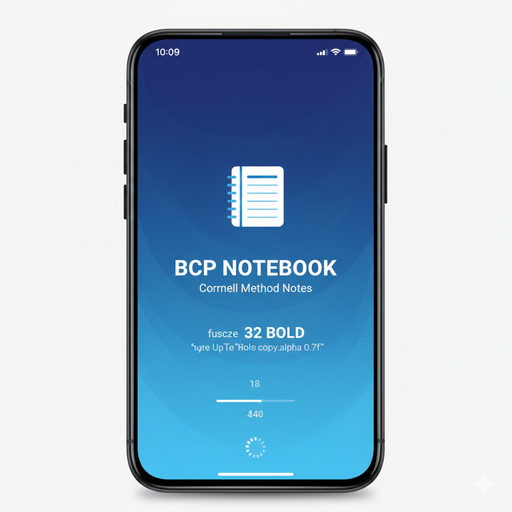

<p align="center">
  
</p>

<h1 align="center">📘 BCP Notebook</h1>

<p align="center">
  <b>A Secure, Cloud-Ready, Professional Digital Notebook</b><br/>
  Cornell Method • Firebase Auth • Native Android • Offline First
</p>

<p align="center">
  
  
  
  
  
</p>

---

## 📌 Overview

**BCP Notebook** is a modern, secure, and production-ready **native Android note-taking application** designed for students, professionals, and researchers.

The app is inspired by the **Cornell Note-Taking System** and combines it with:
- Real-time autosave  
- Firebase-based authentication  
- Secure cloud data storage  
- Offline-first architecture  

Unlike web-based note apps, **BCP Notebook is a true native Android application**, built for performance, privacy, and long-term scalability.

---

## ✨ Key Highlights

- ✅ 100% Native Android (No WebView)
- 🔐 Real Email & Password Authentication
- ☁️ Secure Cloud Sync with Firebase
- 🧠 Cornell Method Page Design
- 💾 Offline-First with Auto Sync
- 📱 Mobile & Tablet Optimized
- 🛡️ Privacy-Focused Architecture

---

## 🧠 Core Features

### ✍️ Smart Note-Taking
- Cornell-style layout:
  - **Clues / Keywords**
  - **Main Notes**
  - **Summary**
- Smooth, lag-free typing
- Unlimited note length
- Subject-based organization

### 🔐 Authentication & Security
- Firebase Email/Password authentication
- No plaintext passwords stored
- Secure user session handling
- User-specific data isolation

### ☁️ Cloud Database
- Firebase Firestore
- Notes stored per user (UID-based)
- Automatic offline caching
- Seamless background sync

### 🎨 Professional UI/UX
- Jetpack Compose + Material 3
- Dark & Light theme support
- Responsive layout (phone & tablet)
- Clean splash / landing screen
- Minimal, distraction-free design

### 📤 Export & Productivity
- Export notes to TXT
- Export notes to PDF
- Revision-friendly summary section
- Designed for exams, meetings, and research

---

## 🏗️ Architecture


BCP Notebook (Android App) | |-- Jetpack Compose UI |-- ViewModel (State Management) | v Firebase Authentication | v Firebase Firestore (Cloud Database) | v Offline Cache + Auto Sync

---

## 📁 Project Structure

BCP-Notebook/ ├── app/ │   ├── ui/ │   │   ├── SplashScreen.kt │   │   ├── LoginScreen.kt │   │   ├── RegisterScreen.kt │   │   └── NotebookScreen.kt │   ├── viewmodel/ │   │   ├── AuthViewModel.kt │   │   └── NoteViewModel.kt │   ├── firebase/ │   │   ├── FirebaseAuthManager.kt │   │   └── FirestoreManager.kt │   ├── model/ │   │   └── NoteModel.kt │   └── MainActivity.kt ├── assets/ │   └── logo.png ├── build.gradle ├── google-services.json └── README.md

---

## 🔒 Data & Privacy Model

- User authentication handled by **Firebase Auth**
- Notes stored securely in **Firebase Firestore**
- Each user can access **only their own data**
- Firestore security rules enforced
- No ads, no trackers, no data selling

---

## 🔐 Firestore Security Rules

```js
rules_version = '2';
service cloud.firestore {
  match /databases/{database}/documents {
    match /users/{userId}/notes/{noteId} {
      allow read, write: if request.auth != null
        && request.auth.uid == userId;
    }
  }
}


---

## 🛠️ Build Instructions (Termux / Linux)

Requirements

JDK 17+

Android SDK

Gradle


Build Command

./gradlew assembleRelease --no-daemon

Output

app/build/outputs/apk/release/app-release.apk


---

## 📱 Minimum Requirements

Android 8.0 (API 26) or higher

Internet (for login & sync)

Offline usage supported after login


---

## 🧪 Development Status

✅ Core notebook system

✅ Firebase authentication

✅ Cloud database

✅ Offline support

🚧 Advanced search (planned)

🚧 AI-assisted summary (planned)

🚧 Biometric unlock (planned)


---

## 🗺️ Roadmap

🔍 Full-text search

🔐 Biometric authentication

📂 Multiple notebooks

🤖 AI-powered summaries

🌐 Web dashboard (optional)

🏪 Play Store release


---

## 🤝 Contributing

Contributions, issues, and feature requests are welcome.

Steps:

1. Fork the repository


2. Create a new branch


3. Commit your changes


4. Open a Pull Request


---

## 📄 License

This project is licensed under the MIT License.
See the LICENSE file for full details.


---

## 👨‍💻 Team & Credits

BCP Notebook
Developed by Bangladesh Cyber Panthers (BCP)
Lead Developer: cybernahid-dev


---

## ⭐ Final Note

BCP Notebook is built with a long-term vision:
to provide a secure, professional, and distraction-free digital notebook for serious learners and professionals.

If you find this project useful, consider giving it a ⭐ on GitHub.

---
